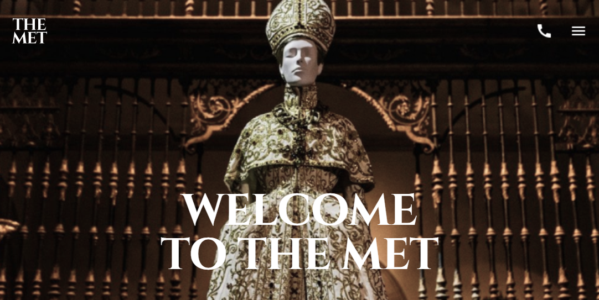
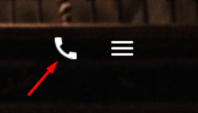
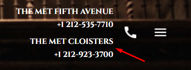

<h1 align="center">MET Landing Page</h1>

# Project Description:

This landing page is dedicated to **The Metropolitan Museum of Art**, also known as **THE MET**, and contains basic information about the museum, its exhibitions, opening hours, and contacts.

**The MET** landing page project involves the implementation of a responsive landing page based on _Figma design_. It has _4 sections_ and _a burger menu_. The implementation was carried out using the _BEM_ (Block Element Modifier) methodology and _SCSS_ for styling. The page was _adapted_ to different screen sizes, which ensured an optimal user experience on all devices.

## Link by layout page

[DEMO LINK](https://galers.github.io/projects-portfolio-MET-landing/)

## Link by figma design

[Figma design](https://www.figma.com/design/lSR1m42L9YwzQwzzxKwHpw/THE-MET?node-id=8590-29&t=I1YuOfVDcN7zNczN-0)

## About the project.

### HTML5

- The entire site is written in HTML5. Using _BEM_ (Block Element Modifier) methodology.

### JS

- Disabled form submission;
- Activation of the Pop-up menu (burger-menu);
- When the burger menu is activated, the scroll disappears;
- Closing the menu by clicking on link.
- Click on the phone icon, a pop-up menu opens:
  
       

### SCSS

The entire page was written using the scss preprocessor.

### Screen Adaptations:

- Large screens 2560px
- The design 1600px
- Desktop 1280px
- Small desktop 1024px
- Tablet 640px
- Mobile (> 320px)
